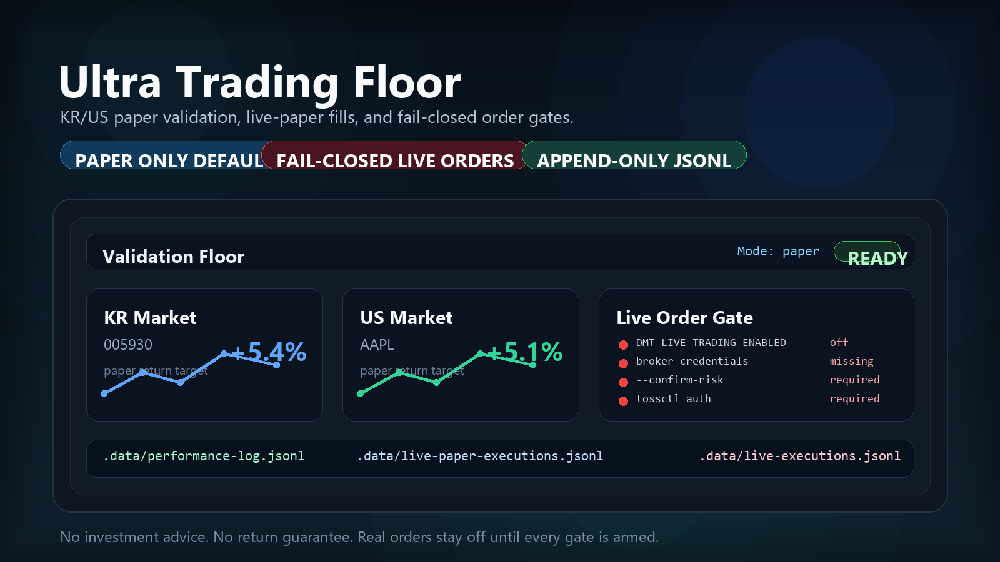

<br />

<h1 align="center">Ultra Trading Floor</h1>

<p align="center"><b>Guarded KR/US paper validation and fail-closed live execution for solo trading research.</b></p>

<p align="center">
  
</p>

<p align="center">
  <a href="docs/OPERATING.md"><b>Operating notes</b></a> -
  <a href="docs/SAFETY.md"><b>Safety contract</b></a> -
  <a href="LICENSE"><b>MIT License</b></a> -
  <a href="https://github.com/ashmoonori-afk/ultra-trading-floor/issues"><b>Issues</b></a>
</p>

<p align="center">
  
  
  
  
</p>

Meet **Ultra Trading Floor**, a separate dual-market trading lab for testing KR and US strategies with deterministic paper data, append-only evidence, a local WebUI dashboard, live-clock paper validation, and a real live-order path that stays off until every safety gate is explicitly armed.

> Ultra Trading Floor is not investment advice, not a return guarantee, and not a fixed-yield system. The 5% daily return target is a validation hurdle for deterministic paper evidence only.

## What it does

- Runs a repeatable improvement loop across KR and US sample markets.
- Records every paper run to `.data/paper-runs.jsonl` and `.data/performance-log.jsonl`.
- Separates live-clock paper fills from real live orders with `.data/live-paper-executions.jsonl`.
- Keeps successful real live executions in `.data/live-executions.jsonl`.
- Serves a local dashboard for paper performance, validation status, live-paper fills, and live execution history.
- Reuses the existing Toss-style live-order shape: auth status, preview, confirm token, then place.
- Refuses live orders by default when credentials, risk confirmation, or Toss permission state are missing.

## Installation

Ultra Trading Floor is a Python 3.13+ project managed with `uv`.

```bash
git clone https://github.com/ashmoonori-afk/ultra-trading-floor.git
cd ultra-trading-floor
uv sync --dev
```

Create local secrets only when you are intentionally testing live-order gates:

```bash
cp .env.example .env
```

Do not commit `.env` or runtime state under `.data/`.

## Quick start

Run the deterministic paper validation loop:

```bash
uv run dual-market-paper-trader run-once \
  --markets KR,US \
  --target-daily-return-pct 5.0 \
  --sample deterministic \
  --evidence-dir .omo/evidence
```

The bundled sample is intentionally local and deterministic. `--sample deterministic` is the only supported sample mode today.

Start the WebUI dashboard:

```bash
uv run dual-market-paper-trader dashboard \
  --host 127.0.0.1 \
  --port 8765 \
  --log .data/performance-log.jsonl \
  --live-paper-log .data/live-paper-executions.jsonl \
  --live-log .data/live-executions.jsonl
```

Open `http://127.0.0.1:8765`.

## Features

- **Dual-market validation**
  Paper backtests cover the configured KR and US markets before a candidate can be considered validated.

- **Strict validation status**
  `validation_status=pass` means the selected candidate met target return, traded every requested market, stayed non-negative per market, stayed inside drawdown limits, cleared both primary training and validation scenarios, and did not require fallback.

- **Fallback transparency**
  `validation_status=fallback` means no candidate passed every gate. The selected fallback is analysis evidence only and keeps `target_met=false`.

- **Live-clock paper validation**
  `run-live-paper` uses the same order intent fields as the live path, runs on a real-time cycle, and writes only paper fills. It never places a brokerage order.

- **Fail-closed live execution**
  `trade-live` and `run-live` exit nonzero and write no order artifact unless every live-order gate is present.

- **Append-only operating trail**
  JSONL logs keep paper performance, live-paper fills, live execution results, validation failures, fallback strategy, and report lineage separate.

## Live paper validation

Run this before any live-order attempt:

```bash
uv run dual-market-paper-trader run-live-paper \
  --market KR \
  --symbol 005930 \
  --side buy \
  --quantity 1 \
  --price 71000 \
  --max-cycles 3 \
  --interval-seconds 30
```

Each cycle appends to `.data/live-paper-executions.jsonl`. Broker credentials are not required.

## Live trading

Real live execution is intentionally harder to start than paper validation:

```bash
uv run dual-market-paper-trader run-live \
  --market KR \
  --symbol 005930 \
  --side buy \
  --quantity 1 \
  --price 71000 \
  --max-cycles 1 \
  --interval-seconds 30 \
  --confirm-risk
```

The command still refuses to place an order unless all of the following are true:

- `DMT_LIVE_TRADING_ENABLED=true`
- `DMT_BROKER_API_KEY` is set
- `DMT_BROKER_API_SECRET` is set
- `TOSS_ALLOW_LIVE_ORDERS=true`
- `--confirm-risk` is present
- `tossctl` is installed and authenticated

`--price` is required for `trade-live`, `run-live`, and `run-live-paper`.

## Built with


## Verify

```bash
uv run pytest
uv run ruff check .
uv run ruff format --check .
uv run basedpyright
```

For a live safety smoke test without credentials:

```bash
uv run dual-market-paper-trader run-live \
  --market KR \
  --symbol 005930 \
  --side buy \
  --quantity 1 \
  --price 71000 \
  --max-cycles 1
```

Expected result: nonzero exit, missing live-gate message, and no live order artifact.

## Documentation

- [Operating notes](docs/OPERATING.md)
- [Safety contract](docs/SAFETY.md)
- [Example paper target config](examples/paper_target_5.json)

## Community

Use [GitHub Issues](https://github.com/ashmoonori-afk/ultra-trading-floor/issues) for bugs, feature ideas, documentation fixes, and safety review notes. Keep brokerage secrets, account screenshots, and personal trading data out of public issues.

## Security

Do not publish broker credentials, Toss session artifacts, `.env`, `.data/`, or account exports. Report sensitive findings privately to the maintainer instead of opening a public issue with secrets.

## License

Ultra Trading Floor is released under the [MIT License](LICENSE).
